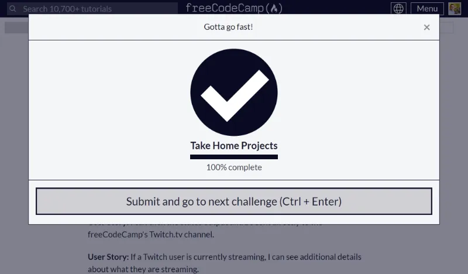
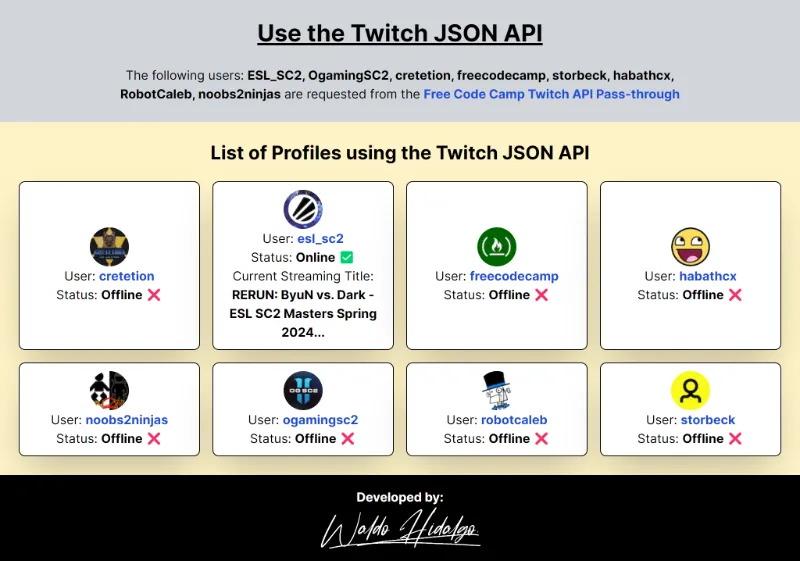

# Use the Twitch JSON API Project

Proyecto [Use the Twitch JSON API](https://www.freecodecamp.org/learn/coding-interview-prep/take-home-projects/use-the-twitch-json-api) requisito obligatorio para obtener la **Legacy Front End Certification de Freecodecamp**.

El proyecto utiliza la [**Free Code Camp Twitch API Pass-through**](https://twitch-proxy.freecodecamp.rocks/) la cual permite obtener la data justa y necesaria para realizar este proyecto.

## Tabla de Contenidos

- [Use the Twitch JSON API Project](#use-the-twitch-json-api-project)
  - [Tabla de Contenidos](#tabla-de-contenidos)
  - [Proyecto Aprobado](#proyecto-aprobado)
  - [Screenshot: Proyecto Funcionando](#screenshot-proyecto-funcionando)

## Proyecto Aprobado

## Screenshot: Proyecto Funcionando

